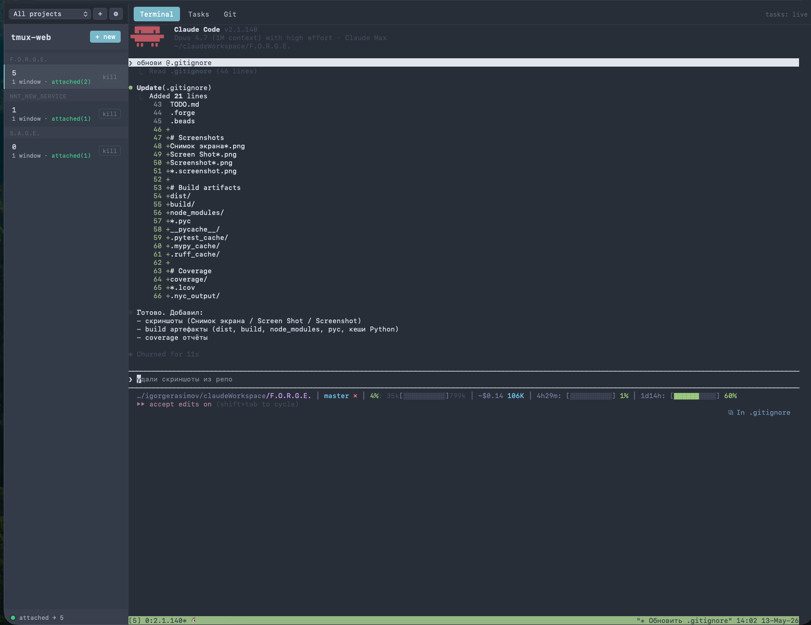
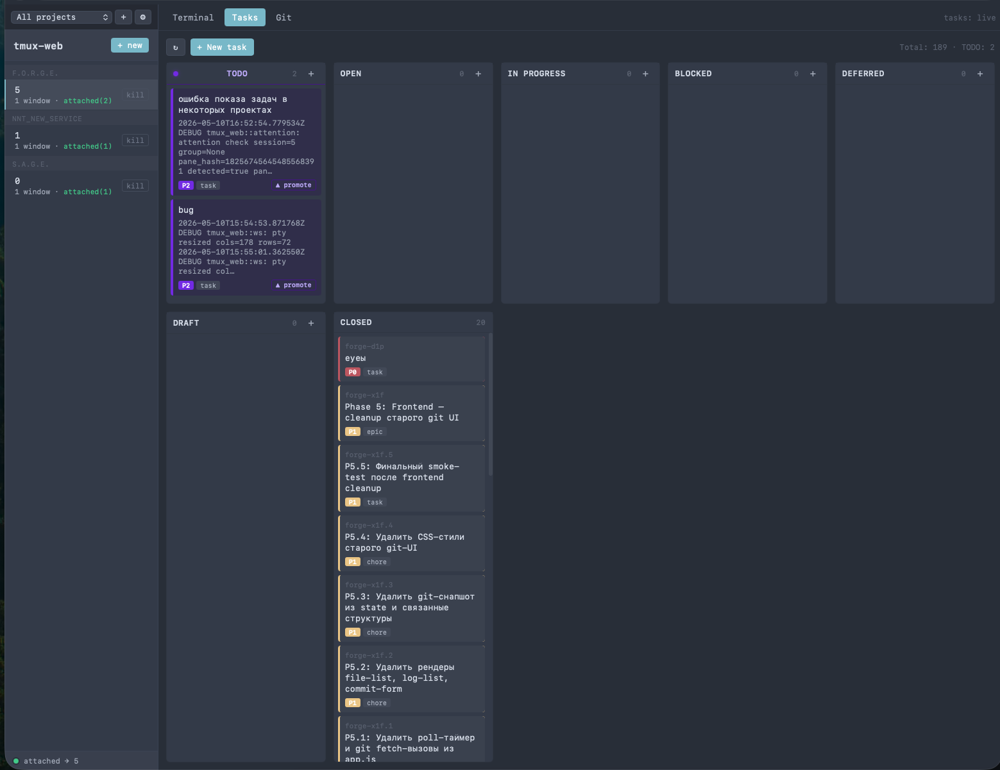
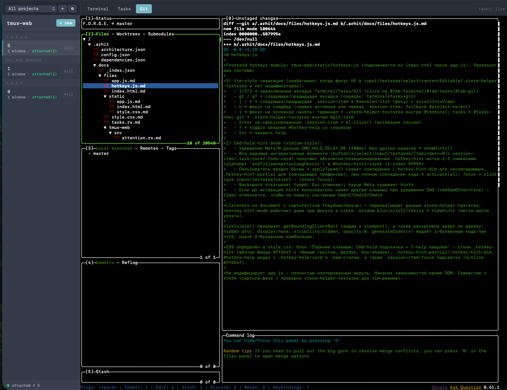

<div align="center">



<h1 align="center">F.O.R.G.E.</h1>

<p align="center"><em>Flow Orchestration and Real-time Governance Engine</em></p>

<p align="center"><strong>Веб-кокпит для разработчика: tmux + канбан + git + AI-агенты в одном окне.</strong></p>

<p align="center">
  <a href="https://www.rust-lang.org"></a>
  <a href="https://github.com/tokio-rs/axum"></a>
  <a href="https://xtermjs.org"></a>
  <a href="https://docs.anthropic.com/en/docs/claude-code"></a>
  <a href="LICENSE"></a>
  
</p>

<p align="center">
  <a href="#-возможности">Возможности</a> ·
  <a href="#-архитектура">Архитектура</a> ·
  <a href="#-быстрый-старт">Старт</a> ·
  <a href="#-claude-code-интеграция">Claude</a> ·
  <a href="#-rest-api">API</a>
</p>

</div>

---

## 📜 Что это

**F.O.R.G.E.** — единый рабочий стол для разработчика, который держит в одной вкладке браузера всё, ради чего раньше держал четыре терминала и три приложения:

- живые **tmux-сессии** через WebSocket + xterm.js,
- **канбан-доски** на базе [beads_rust](https://github.com/Dicklesworthstone/beads_rust),
- **lazygit**, **lazydocker** и **television** (fuzzy-finder) — каждый в своей браузерной вкладке,
- **TODO**-конвейер, прокидывающий задачи прямо в tmux-сессию,
- **AI-агенты** Claude Code (декомпозиция плана, выполнение фаз, трекинг времени),
- мульти-проектность, темы, нотификации.

Один Rust-бинарь, без Node, без Docker.

---

## 🖼️ Скриншоты

<div align="center">

<table>
  <tr>
    <td align="center" width="50%">
      
      <br/>
      <sub><b>🖥️ Terminal</b> — tmux-сессии через xterm.js + WebSocket</sub>
    </td>
    <td align="center" width="50%">
      
      <br/>
      <sub><b>📋 Tasks</b> — канбан-доска на beads_rust с live-стримом</sub>
    </td>
  </tr>
  <tr>
    <td colspan="2" align="center">
      
      <br/>
      <sub><b>🌿 Git</b> — встроенный lazygit через PTY/WebSocket</sub>
    </td>
  </tr>
</table>

</div>

---

## ✨ Возможности

### 🖥️ Terminal & tmux

- **Полноценный tmux в браузере** — xterm.js + WebSocket-bridge, `xterm-256color`, true-color.
- **Список сессий** в реальном времени: имя, окна, клиенты, время создания.
- **Создание / удаление / hot-switch** сессий без перезагрузки страницы.
- **Авто-resize PTY** при изменении размера окна.
- **Выбор папки запуска** новой tmux-сессии (произвольный cwd).
- Один бинарь, рантайм-зависимость только `tmux`.

### 📋 Tasks (Kanban на beads)

- Канбан-доска на каждый проект, статусы из `br` (beads).
- WebSocket-стрим `/ws/tasks` — изменения в `.beads/issues.jsonl` прилетают в UI мгновенно (file-watcher через `notify`).
- Создание / закрытие / reopen / patch — прямо из UI, ходит через REST в `br`.
- Приоритеты P0–P4, типы (task / bug / feature / epic / chore / docs / question), зависимости.

### ✅ TODO-конвейер

- Стадии: **inbox → нужно сделать → сделано**.
- Промоут TODO → tmux-сессия: при переводе задачи в активную стадию текст уходит **в нужную tmux-сессию проекта** как промпт.
- Настройка отправки: сразу или после завершения предыдущей TODO в этом проекте.
- WebSocket-стрим `/ws/todos`.

### 🧰 TUI-табы (lazygit / lazydocker / television)

Три вкладки, построенные на общем фреймворке `createTuiTab`: отдельный `xterm.js`-инстанс в браузере, отдельный WebSocket на сервере, PTY-процесс работает в cwd активного проекта. Переключение проекта прозрачно дёргает `switch_cwd` (kill old → spawn new в новом каталоге, тот же WS).

- 🌿 **Git** — встроенный [`lazygit`](https://github.com/jesseduffield/lazygit) (`/ws/lazygit`).
- 🐳 **Docker** — встроенный [`lazydocker`](https://github.com/jesseduffield/lazydocker) (`/ws/lazydocker`).
- 🔭 **Find** — встроенный [`television`](https://github.com/alexpasmantier/television) (`tv`), fuzzy-finder в духе telescope.nvim (`/ws/telescope`). Над терминалом — переключатель каналов **`Files / Content / Dirs / Git log`** (Files = по именам через fd, Content = по содержимому через ripgrep, Dirs = по каталогам, Git log = по коммитам). Клик по кнопке — мгновенный reconnect с новым каналом. Требует helpers `fd` + `bat` + `rg` — ставятся одной командой `brew install television fd bat ripgrep`.

Каждая вкладка:

- автодетектит установку бинаря и показывает install-banner с командами для macOS/Linux при отсутствии,
- поддерживает retry + ResizeObserver + Binary-frame stdin (контракт идентичен `/ws/attach`),
- работает в remote-режиме через generic `remote_proxy` — `?server=<id>` прозрачно проксируется на upstream-сервер по тому же пути.

**Копирование текста из preview-панели:** TUI-программы (tv/lazygit/lazydocker) захватывают мышь, поэтому обычное выделение не работает. Используй стандартный xterm.js-bypass:

- macOS: `⌥ Option + drag` для selection → `⌘ Cmd + C` для копирования
- Linux/Windows: `Shift + drag` для selection → `Ctrl + Shift + C` для копирования

### 📁 Projects

- Несколько проектов, каждый со своим `.beads/`, `.forge/`, темой, настройками.
- `POST /api/projects/init` — инициализация: создаёт `CLAUDE.md`, `TODO.md`, `.gitignore`, делает `git init`.
- Активный проект сохраняется на сервере, переключение в один клик.

### 🎨 Темы (9 пресетов + custom)

`Default · Dracula · Solarized Dark · Solarized Light · Monokai · Nord · Gruvbox Dark · One Dark · Tokyo Night`

- Единая модель `Theme { ui, term }` — красит и UI, и xterm.js.
- Пользовательские темы (CRUD `/api/themes/custom`), атомарное сохранение в `themes.json`.

### 🔔 Notifications & Attention

- `attention.rs` — детектор «требует внимания» в tmux-сессии (ANSI bell, кастомные триггеры).
- `notifier.rs` — десктоп-нотификации с шаблонизатором сообщений.
- Состояние в `.forge/notify_state.json`.

### ⌨️ UX

- Vim-style hotkeys + Cmd-hint mode (`hotkeys.js`).
- Sidebar + табы (Terminal / Tasks / Git / Docker / Find), полностью клавиатурный воркфлоу.
- Status-dot WS-соединения, авто-reconnect.

---

## 🧠 Claude Code-интеграция

Проект заточен под совместную работу с **Claude Code** (Anthropic CLI).

## 🏗️ Архитектура

```
┌──────────────────────────────────────────────────────────────────────┐
│  Browser (xterm.js + app.js + hotkeys.js)                            │
│  Terminal │ Tasks │ Git │ Docker │ Find │ Themes                     │
└─────┬─────────────┬──────────────┬──────────────┬────────────────────┘
      │ WS /ws/attach              │ WS /ws/lazygit                    │
      │ WS /ws/lazydocker          │ WS /ws/telescope                  │
      │ WS /ws/tasks               │ WS /ws/todos                      │
      │ (binary PTY / JSON events)                                     │
┌─────▼──────────────────────────────────────────────────────────────┐
│  Rust server (axum 0.7 + tokio)                                    │
│  REST: /api/sessions /api/tasks /api/todos /api/projects /api/themes │
│                                                                    │
│  pty.rs ── portable-pty ── tmux attach / lazygit / lazydocker / tv │
│  ws.rs  ── generic handle_tui_socket<F> для всех TUI-табов        │
│  tasks.rs ── shells out to `br` (beads_rust)                       │
│  tasks_watcher.rs ── notify(6) ── .beads/issues.jsonl              │
│  projects.rs ── .forge/projects.json + git init scaffolding        │
│  themes.rs   ── 9 presets + custom (atomic write)                  │
│  attention.rs + notifier.rs ── desktop notifications               │
│  remote_proxy.rs ── прозрачный WS-proxy на upstream-серверы       │
└────────────────────────────────────────────────────────────────────┘
```

| Модуль                               | Назначение                                                                                                                              |
| ------------------------------------------ | ------------------------------------------------------------------------------------------------------------------------------------------------- |
| `src/main.rs`                            | Axum-роутер, REST endpoints, статика, health-check.                                                                                  |
| `src/tmux.rs`                            | Обёртка над `tmux` CLI: list / new / kill.                                                                                            |
| `src/pty.rs`                             | `portable-pty` + `tmux attach` / `lazygit` / `lazydocker` / `tv` на одну WS-сессию.                                         |
| `src/ws.rs`                              | WebSocket-bridge: байты PTY ↔ браузер + control-сообщения. Generic `handle_tui_socket<F>` для всех TUI-табов. |
| `src/remote_proxy.rs`                    | Прозрачный WS-proxy для remote-режима (все `/ws/*` пути, включая TUI).                                         |
| `src/tasks.rs`                           | REST `/api/tasks`, дёргает `br`.                                                                                                       |
| `src/ws_tasks.rs` + `tasks_watcher.rs` | WS-стрим изменений `.beads/issues.jsonl`.                                                                                         |
| `src/todos.rs` + `ws_todos.rs`         | TODO-конвейер с прокидыванием в tmux.                                                                                      |
| `src/projects.rs`                        | Мульти-проекты, init, активный проект.                                                                                 |
| `src/themes.rs`                          | 9 пресетов + custom темы.                                                                                                             |
| `src/attention.rs` + `notifier.rs`     | Десктоп-нотификации.                                                                                                            |
| `static/`                                | `index.html`, `app.js` (~4.5k), `style.css` (~2.2k), `hotkeys.js`.                                                                        |

---

## 🚀 Быстрый старт

### 🍺 Установка через Homebrew (macOS)

Один self-contained бинарь `devforge` — статика (HTML/CSS/JS, xterm.js) встроена прямо в исполняемый файл через [rust-embed](https://crates.io/crates/rust-embed), отдельный каталог `static/` не нужен.

```bash
brew tap darkClaw921/tap
brew install devforge
devforge          # стартует на http://127.0.0.1:7331
```

> Если ранее уже подключали неправильный tap — отвяжите его:
> `brew untap darkClaw921/devforge 2>/dev/null || true`

### 🎛 Команды и флаги

```bash
devforge                       # foreground на http://127.0.0.1:7331 (дефолт)
devforge run --port 8080       # foreground на кастомном порту
devforge start                 # запустить как daemon в фоне
devforge start --port 8080     # daemon на кастомном порту
devforge status                # показать состояние daemon (PID + порт)
devforge stop                  # остановить daemon (SIGTERM, fallback SIGKILL через 5s)
devforge --help                # полный список опций
```

| Команда        | Что делает                                                                                                                                           |
| --------------------- | ------------------------------------------------------------------------------------------------------------------------------------------------------------- |
| `run` *(default)* | Запускает сервер в foreground. Логи в stdout. Завершается по `Ctrl+C`.                                                    |
| `start [--port N]`  | Спавнит daemon через `setsid(2)`, PID пишется в `~/.config/forge/devforge.pid`, stdout/stderr — в `~/.config/forge/devforge.log`. |
| `stop`              | Читает PID, шлёт `SIGTERM`, ждёт до 5 секунд, при таймауте — `SIGKILL`.                                                 |
| `status`            | Печатает «running (PID …)» или «not running»; детектит stale pid-файлы после краша.                                    |

Опция `-p` / `--port <N>` (default `7331`) валидна для `run` и `start`. Сервер всегда биндится на `127.0.0.1` — наружу не торчит.

**Daemon-файлы** (создаются в `~/.config/forge/`):

- `devforge.pid` — PID запущенного daemon'а
- `devforge.log` — append-only лог daemon'а (stdout + stderr)
- `projects.json` — реестр проектов (общий с foreground-режимом)

**Runtime-зависимости:**

- **обязательно:** `tmux` в `$PATH` (нужен для Terminal-вкладки и подцеплен в формуле как `depends_on`).
- *(опционально)* `lazygit` — для встроенной Git-вкладки (`brew install lazygit`).
- *(опционально)* `lazydocker` — для встроенной Docker-вкладки (`brew install lazydocker`).
- *(опционально)* **Find-вкладка** требует **четыре** бинаря — `tv` ([television](https://github.com/alexpasmantier/television)) + `fd` + `bat` + `rg` ([ripgrep](https://github.com/BurntSushi/ripgrep)). По умолчанию вкладка стартует в режиме `files` (поиск по именам через fd), переключатель каналов в UI: `Files / Content / Dirs / Git log`. `rg` нужен для канала Content, `bat` — для preview. Без любой из утилит панели покажут `command not found`. Одной командой:
  - macOS: `brew install television fd bat ripgrep`
  - Arch: `sudo pacman -S television fd bat ripgrep`
  - Fedora: `sudo dnf copr enable atim/television -y && sudo dnf install television fd-find bat ripgrep`
  - Debian/Ubuntu: `sudo apt install fd-find bat ripgrep && cargo install --locked television`
  - any (через Cargo): `cargo install --locked television fd-find bat ripgrep`
- *(опционально)* `br` ([beads_rust](https://github.com/Dicklesworthstone/beads_rust)) — для канбан-доски в Tasks-вкладке.

Как устроен tap (`homebrew-devforge`), как обновлять формулу и как сделать релиз — см. [`docs/homebrew-tap-setup.md`](docs/homebrew-tap-setup.md).

### Требования (сборка из исходников)

- **Rust** 1.75+
- **tmux** в `$PATH`
- **macOS / Linux** (Windows не поддерживается из-за PTY)
- *(опционально)* `lazygit` для Git-вкладки
- *(опционально)* `lazydocker` для Docker-вкладки
- *(опционально)* `tv` + `fd` + `bat` + `rg` для Find-вкладки (одной командой: `brew install television fd bat ripgrep`)
- *(опционально)* `br` ([beads_rust](https://github.com/Dicklesworthstone/beads_rust)) для канбана
- *(опционально)* Claude Code CLI для AI-агентов

### Сборка и запуск

```bash
git clone https://github.com/darkClaw921/F.O.R.G.E.
cd F.O.R.G.E./tmux-web
cargo run --release
```

Открыть: **http://127.0.0.1:7331**

### Логирование

```bash
RUST_LOG=tmux_web=trace,tower_http=debug cargo run --release
```

### Инициализация нового проекта в UI

`Sidebar → ⚙ Settings → New project → Init`. Создаёт `CLAUDE.md`, `TODO.md`, `.gitignore`, делает `git init`.

### 🔁 Pre-commit hook (тесты + авто-бамп версии)

В `.githooks/pre-commit` лежит хук, который перед каждым коммитом:

1. **Запускает `cargo test`** (если в staged-изменениях есть `.rs` / `Cargo.toml` / `Cargo.lock`). При падении тестов коммит abort'ится — в репозиторий не уйдёт сломанный код. Docs-/README-/JS-only коммиты тесты пропускают (быстро).
2. **Инкрементирует patch-версию** devforge в `tmux-web/Cargo.toml` и в соответствующем блоке `[[package]]` `Cargo.lock`: `0.1.0 → 0.1.1 → 0.1.2 → …`. Изменения автоматически добавляются в индекс — попадают в тот же коммит.

Включается **один раз** на клон репозитория:

```bash
git config core.hooksPath .githooks
```

Параметры:

- тесты прогоняются через `cargo test --quiet --color=always` в `tmux-web/`;
- bump версии работает только если она имеет формат `X.Y.Z` (SemVer-подобный) — иначе пропускается без падения;
- MAJOR/MINOR никогда не трогаются, только PATCH;
- bypass: `git commit --no-verify` (отключает и тесты, и bump — только при крайней необходимости).

---

## 📡 REST API

| Method                      | Path                                | Описание                                   |
| --------------------------- | ----------------------------------- | -------------------------------------------------- |
| GET                         | `/healthz`                        | Health-check.                                      |
| GET / POST                  | `/api/sessions`                   | Список / создание tmux-сессий. |
| DELETE                      | `/api/sessions/:name`             | Убить сессию.                           |
| GET / POST                  | `/api/tasks`                      | Канбан-задачи (`br`).                |
| PATCH / DELETE              | `/api/tasks/:id`                  | Обновить / закрыть задачу.    |
| POST                        | `/api/tasks/:id/reopen`           | Переоткрыть закрытую.           |
| GET / POST                  | `/api/projects`                   | Проекты.                                    |
| PATCH                       | `/api/projects/:id/settings`      | Настройки проекта.                 |
| POST                        | `/api/projects/active`            | Сделать активным.                   |
| POST                        | `/api/projects/init`              | Init (CLAUDE.md, TODO.md, git).                    |
| GET / POST / PATCH / DELETE | `/api/todos[/:id]`                | TODO CRUD.                                         |
| POST                        | `/api/todos/:id/promote`          | Промоут TODO → tmux.                       |
| GET / PATCH                 | `/api/themes[/active]`            | Темы.                                          |
| POST / PUT / DELETE         | `/api/themes/custom[/:id]`        | Custom-темы.                                   |
| GET (WS)                    | `/ws/attach?session=&cols=&rows=` | tmux attach.                                       |
| GET (WS)                    | `/ws/lazygit?cwd=&cols=&rows=`    | lazygit TUI в cwd проекта.                 |
| GET (WS)                    | `/ws/lazydocker?cwd=&cols=&rows=` | lazydocker TUI в cwd проекта.              |
| GET (WS)                    | `/ws/telescope?cwd=&cols=&rows=`  | television (`tv`) fuzzy-finder.                  |
| GET (WS)                    | `/ws/tasks` / `/ws/todos`       | Live-стримы JSON.                            |

---

## 🔌 WebSocket-протокол (terminal)

`ws://127.0.0.1:7331/ws/attach?session=<name>&cols=<u16>&rows=<u16>`

| Frame  | Направление | Содержимое                            |
| ------ | ---------------------- | ----------------------------------------------- |
| Binary | Both                   | Сырые байты PTY (`xterm-256color`). |
| Text   | Client → Server       | JSON control:`resize`, `switch`.            |
| Close  | Both                   | Teardown: kill PTY + wait child.                |

```jsonc
{ "type": "resize", "cols": 120, "rows": 40 }
{ "type": "switch", "session": "other" }
```

---

## 🧩 Конфигурация

| Переменная | Назначение                                | По умолчанию |
| -------------------- | --------------------------------------------------- | ----------------------- |
| `RUST_LOG`         | Уровень логирования (`tracing`) | `info,tmux_web=debug` |

Привязка: `127.0.0.1:7331` (hardcoded на текущей фазе).

Каталог `static/` ищется: `./static` → `<exe>/../static`.

State-файлы:

- `.beads/issues.jsonl` — задачи (под git).
- `.forge/todos.json` — TODO-стейт.
- `.forge/notify_state.json` — нотификации.
- `<data_dir>/themes.json` — темы.
- `<data_dir>/projects.json` — проекты.

---

## 🛠️ Разработка

```bash
cargo check
cargo clippy -- -D warnings
cargo fmt
cargo test
```

### Workflow с Claude Code

```bash
# Начало сессии
br ready                       # доступные задачи
arhit context                  # контекст проекта

# Работа
br update <id> --status=in_progress
# ... код + arhit doc add <el> --content "..."
br close <id>

# Конец сессии
br sync --flush-only
git status && git push
```

---

## 📦 Стек

- [`axum`](https://github.com/tokio-rs/axum) 0.7 — HTTP + WebSocket
- [`tokio`](https://tokio.rs) — async runtime
- [`portable-pty`](https://crates.io/crates/portable-pty) 0.8 — PTY
- [`tower-http`](https://crates.io/crates/tower-http) 0.6 — `ServeDir` + tracing
- [`notify`](https://crates.io/crates/notify) 6 — file-watcher `.beads`
- [`tracing`](https://crates.io/crates/tracing) — структурный лог
- [`xterm.js`](https://xtermjs.org) 5.3 + `fit` + `web-links` — терминал
- [`beads_rust`](https://github.com/Dicklesworthstone/beads_rust) (`br`) — issue tracker
- [`lazygit`](https://github.com/jesseduffield/lazygit) — git UI
- [`lazydocker`](https://github.com/jesseduffield/lazydocker) — docker UI
- [`television`](https://github.com/alexpasmantier/television) (`tv`) — fuzzy-finder
- [`arhit`](https://github.com/) — архитектурная документация
- [Claude Code](https://docs.anthropic.com/en/docs/claude-code) — AI-агенты

---

## 🗺️ Roadmap

- [X] tmux-сессии в браузере (WS + xterm.js)
- [X] Канбан на beads + file-watcher
- [X] TODO-конвейер с прокидыванием в tmux
- [X] Lazygit-таб
- [X] Lazydocker-таб
- [X] Telescope/Find-таб (television)
- [X] Generic TUI-tab framework (`createTuiTab` + `handle_tui_socket<F>`)
- [X] Мульти-проекты + init
- [X] 9 тем + custom
- [X] Sub-agents (create-tasks / run-phase / time-tracker)
- [ ] Touch DnD (мобилки)
- [ ] BB/RBAC, multi-user
- [ ] Поиск/фильтр по labels/assignee в Tasks
- [ ] Графики/burndown
- [X] Прокидывание задач в tmux текстом (см. `TODO.md` prompt 4)

---

## 📜 Лицензия

MIT © F.O.R.G.E. contributors
